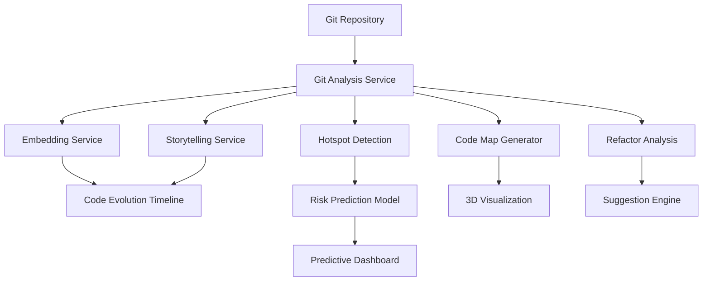
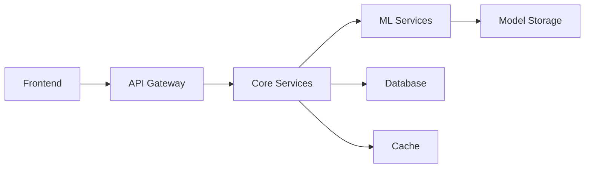

# EchoLens Architecture Documentation

## System Overview

EchoLens is an AI-driven codebase intelligence platform that provides advanced visualization, analysis, and predictive capabilities for large software projects. The system is designed with a modular architecture that separates concerns and allows for easy extension and maintenance.

## Core Components

### 1. Code Evolution Timeline
- **Purpose**: Track and visualize the evolution of code over time
- **Key Components**:
  - Git Analysis Service
  - Embedding Service for semantic analysis
  - Timeline visualization using D3.js

### 2. AI-Powered Change Storytelling
- **Purpose**: Generate human-readable explanations of code changes
- **Key Components**:
  - Storytelling Service
  - Language Models for text generation
  - Template-based narrative generation

### 3. Hotspot & Risk Prediction
- **Purpose**: Identify high-risk areas in the codebase
- **Key Components**:
  - ML models for risk assessment
  - Complexity analysis
  - Activity pattern analysis

### 4. AI Refactor Guide
- **Purpose**: Provide automated refactoring suggestions
- **Key Components**:
  - Code analysis engine
  - Pattern detection
  - Recommendation system

### 5. Interactive 3D Code Map
- **Purpose**: Visualize codebase structure and relationships
- **Key Components**:
  - Three.js visualization
  - Dependency analysis
  - Interactive navigation

### 6. Predictive Insights Dashboard
- **Purpose**: Monitor codebase health and trends
- **Key Components**:
  - Health scoring system
  - Alert generation
  - Integration with external tools

## Data Flow

## AI/ML Components

### 1. Embedding Models
- **Technology**: CodeBERT
- **Purpose**: Generate semantic embeddings for code and text
- **Usage**: Change analysis, similarity detection

### 2. Language Models
- **Technology**: BART
- **Purpose**: Generate human-readable explanations
- **Usage**: Change storytelling, documentation

### 3. Risk Prediction Models
- **Technology**: Custom ML models
- **Purpose**: Identify potential issues
- **Usage**: Hotspot detection, risk assessment

## External Integrations

1. **Version Control**
   - Git repositories
   - GitHub/GitLab APIs

2. **Communication**
   - Slack integration
   - Notion integration

3. **CI/CD**
   - Jenkins/GitHub Actions hooks
   - Automated reporting

## Security Considerations

1. **Code Access**
   - Secure repository access
   - Access control integration

2. **Data Privacy**
   - Local processing of sensitive code
   - Configurable data retention

3. **API Security**
   - Authentication/Authorization
   - Rate limiting

## Performance Optimization

1. **Caching Strategy**
   - Git operation results
   - Embedding computations
   - Visualization data

2. **Computation Distribution**
   - Background processing
   - Task queuing
   - Resource management

## Deployment Architecture

## Configuration Management

1. **Environment Variables**
   - API keys
   - Service endpoints
   - Feature flags

2. **Model Configuration**
   - Model parameters
   - Training settings
   - Inference settings

## Monitoring and Logging

1. **System Health**
   - Service metrics
   - Performance monitoring
   - Error tracking

2. **Usage Analytics**
   - Feature usage
   - User interactions
   - Performance metrics

## Future Extensions

1. **Additional Analysis Types**
   - Architecture compliance
   - Security vulnerability detection
   - Technical debt assessment

2. **Enhanced Visualizations**
   - VR/AR integration
   - Real-time collaboration
   - Custom visualization plugins

3. **Advanced AI Features**
   - Code generation
   - Automated testing
   - Performance optimization

## Development Guidelines

1. **Code Organization**
   - Feature-based structure
   - Clear separation of concerns
   - Consistent naming conventions

2. **Testing Strategy**
   - Unit tests
   - Integration tests
   - Performance tests

3. **Documentation**
   - API documentation
   - User guides
   - Development guides